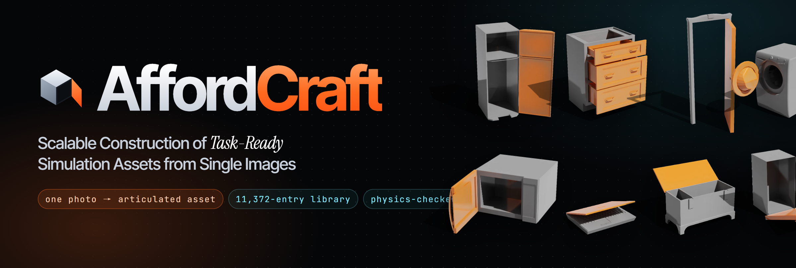
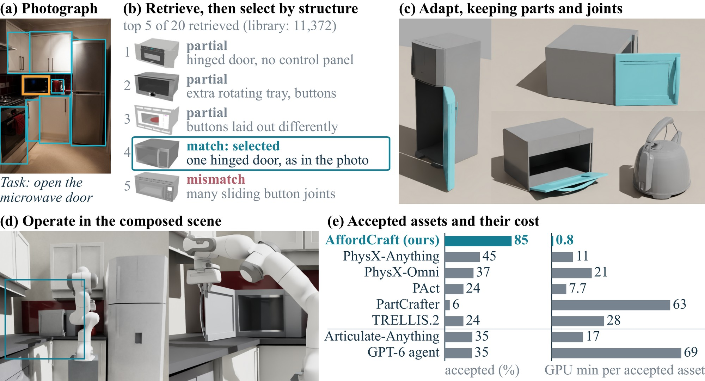

<div align="center">



<h2 align="center">AffordCraft: Scalable Construction of Task-Ready Simulation Assets from Single Images</h2>

<p align="center">
  <b>Haoyun Yang</b><sup>1,2</sup>&emsp;
  <b>Xueyang Zhou</b><sup>1,3</sup>&emsp;
  <b>Ziyi Xie</b><sup>1,4</sup>&emsp;
  <b>Yongchao Chen</b><sup>1,*</sup>
</p>

<p align="center">
  <sup>1</sup>College of AI, Tsinghua University&emsp;
  <sup>2</sup>School of Computer Science, Chongqing University<br>
  <sup>3</sup>School of Cyber Science and Engineering, Huazhong University of Science and Technology<br>
  <sup>4</sup>College of Design and Engineering, National University of Singapore<br>
  <sup>*</sup>Corresponding author
</p>

<h3 align="center">
  <a href="https://affordcraft.github.io/">Project Page</a> |
  <a href="https://affordcraft.github.io/static/paper/AffordCraft.pdf">Paper</a> |
  <a href="https://affordcraft.github.io/#film">Film</a> |
  <a href="https://affordcraft.github.io/#library">Library Explorer</a>
</h3>

<p align="center">
  <a href="https://www.python.org/"></a>&nbsp;
  <a href="LICENSE"></a>&nbsp;
  <a href="https://developer.nvidia.com/isaac/sim"></a>&nbsp;
  <a href="https://affordcraft.github.io/"></a>
</p>

</div>

## 📰 News

- **2026-09-29** — Released the code, the evaluation harness, the external baselines and the analysis scripts; the [project page](https://affordcraft.github.io/) is online.

## ✨ Highlights

<p align="center">
  
</p>

<p align="center"><em>AffordCraft builds a task-ready simulation asset from one RGB image and a task instruction by retrieval instead of generation: it locates the object and the part to operate, selects a matching entry from a library of articulated assets, fits it to the image while keeping its parts and joints intact, and accepts the result only if it passes a physical test in simulation.</em></p>

> **Grounding → retrieval → selection → adaptation → physical gate.** A multimodal model (Qwen3-VL-8B-Instruct) turns the full image and the instruction into the object category, the part to operate, the action and the motion family. DINOv2 features rank rendered library entries into a pool of up to twenty candidates. The multimodal model checks each candidate's category, mechanism and subtype against its recorded parts and joints, or abstains. Adaptation scales and places the chosen entry without changing its bodies or joints. The asset is accepted only if it passes `Export ∧ Inertia ∧ Settle ∧ Support ∧ Joint(part, motion)` in Isaac Sim; a failed candidate may receive one repair, then the next eligible candidate is tried.

- 🧩 **Retrieval instead of generation** — parts, joints and physical parameters are modeled and checked once, in the library; construction selects among them instead of estimating them for every image. The image encoder and the multimodal model can be exchanged, and the library grows by adding entries.
- 📸 **Full image, no box or mask** — AffordCraft produces a physically valid asset for **1,703 of 2,000** photographs from 31 categories (85.15%); 1,132 of its accepted assets have a movable joint.
- ⏱️ **Built once, reused** — because it reuses collision geometry built once for its library, AffordCraft needs 40 s per input at the median on one RTX 5090 and 0.8 GPU-minutes per valid asset. Five generative methods pass on at most 45% of the same photographs and, at the median, need 10 to 78 times our GPU time per valid asset.
- 🧪 **One physical test for every method** — an asset counts only if it exports, carries valid inertia, settles under gravity, rests on real support and moves at the requested part. Seven external methods are scored by the same test, five of them on all 2,000 inputs.
- 🏙️ **Cluttered images** — on 50 cluttered COCO images, 162 of 237 annotated objects pass the same physical test after automatic detection.
- 📚 **Scales with the library** — growing the library from 141 to 11,372 entries needs no change to the method and raises category coverage from 46% to 100% and the share of selections with the requested label from 18% to 51%, while retrieval stays near 50 ms.
- 🤖 **Assets for robot learning** — we build manipulation tasks from the constructed assets, with single objects and in composed scenes; policies trained on scripted demonstrations complete both kinds of tasks from initial states unseen in training.

## 🚀 Installation

```bash
git clone https://github.com/AffordCraft/AffordCraft.git
cd AffordCraft
```

The pipeline runs in three processes with different dependencies. The pinned versions are the ones used for the paper; details are in [docs/setup.md](docs/setup.md).

| Environment | Runs | Requirements |
| :-- | :-- | :-- |
| selector (Python 3.10) | grounding, retrieval, selection and orchestration (`scripts/run_pipeline.py`), visual index, object detection | [`requirements/selector.txt`](requirements/selector.txt) (install PyTorch for your CUDA version first; the paper used CUDA 12.8) |
| runtime (Python 3.10) | asset construction: source-preserving import, adaptation, CoACD decomposition, USD export; the external-method gate | [`requirements/runtime.txt`](requirements/runtime.txt) |
| Isaac Sim 5.1 (Python 3.11) | physics services: construction check and final validation in two independent processes | [`requirements/isaac.txt`](requirements/isaac.txt) |
| analysis (any recent Python 3) | table and figure generators | [`requirements/analysis.txt`](requirements/analysis.txt) |

```bash
pip install -r requirements/selector.txt                                                  # selector environment
pip install -r requirements/runtime.txt                                                   # runtime environment
pip install 'isaacsim[all,extscache]==5.1.0' --extra-index-url https://pypi.nvidia.com   # Isaac Sim environment
pip install -r requirements/isaac.txt --extra-index-url https://pypi.nvidia.com
```

`scripts/run_pipeline.py` starts the physics services and the construction subprocesses itself. It only needs the interpreters and the locations of assets, checkpoints and outputs, all read from environment variables (`affordcraft/paths.py`):

```bash
export AFFORDCRAFT_ISAAC_PYTHON=/path/to/isaac-sim-5.1/python       # physics services
export AFFORDCRAFT_RUNTIME_PYTHON=/path/to/runtime-env/bin/python    # asset construction
export AFFORDCRAFT_PROJECT_ROOT=/path/to/workspace                   # asset sources, catalog/catalog.json, models/
export AFFORDCRAFT_RUNS=runs                                         # outputs
```

- **Models.** [Qwen3-VL-8B-Instruct](https://huggingface.co/Qwen/Qwen3-VL-8B-Instruct) (grounding, selection, object detection) and a DINOv2 image tower with its image processor (retrieval), under `$AFFORDCRAFT_PROJECT_ROOT/models/` ([docs/setup.md](docs/setup.md#models)).
- **Data.** The repository lists the inputs by public Open Images and COCO ids and the 11,372 library entries by their source ids. `scripts/prepare_inputs.py` builds hash-checked manifests from local image copies; the library catalog is built from local copies of PartNet-Mobility, Objaverse, Google Scanned Objects and YCB ([docs/data.md](docs/data.md)).

## ⚡ Quick Start

**1. CPU checks** (no GPU, no Isaac Sim), in the runtime environment:

```bash
python -m unittest discover -s tests    # 104 tests: contracts, geometry, decomposition cascade, detection rules, recovery, study variants
```

Three of the tests use the Unix-only `fork` start method and `resource` module, so run them on Linux.

**2. Rebuild the paper's tables and figures** from the recorded results in [`analysis/results/`](analysis/results/). The table generators need only the standard library; the figures need `requirements/analysis.txt`. Outputs go to `analysis/out/`.

```bash
python analysis/tables/tables_comparison.py    # main comparison, resource and development tables
python analysis/tables/tables_ablation.py      # one-factor study with exact McNemar tests
python analysis/figures/fig_time_to_pass.py    # accepted assets against the time budget per input
python analysis/stats.py                       # self-check: Wilson interval of 1,703/2,000 and 26 McNemar p-values
```

**3. Full pipeline** (GPU, Isaac Sim 5.1, models and library in place; `$SELECTOR` is the selector interpreter):

```bash
$SELECTOR scripts/build_visual_index.py --output runs/index/dinov2 --gpu 0
python scripts/prepare_inputs.py single --open-images /datasets/openimages_v7 --output runs/inputs/single_inputs.json
python scripts/prepare_inputs.py subset --single runs/inputs/single_inputs.json --output runs/inputs/subset_200.json
$SELECTOR scripts/run_pipeline.py --calibration --limit 3 --inputs runs/inputs/subset_200.json \
    --index runs/index/dinov2 --output runs/calibration/pipeline --gpu 0
```

Formal runs first check the physics services on seven known positive and negative controls, freeze the experiment definition (`scripts/freeze_experiment.py`), run in shards, and are merged and scored by `scripts/merge_shards.py` and `scripts/export_final_results.py`. [docs/running.md](docs/running.md) gives the exact commands for the single-object experiment, the one-factor study and the cluttered images.

## 📚 Documentation

| Document | Description |
| :-- | :-- |
| [Setup](docs/setup.md) | The three environments, environment variables, model checkpoints and CPU checks |
| [Data](docs/data.md) | Input manifests (Open Images, COCO), the library index and catalog schema, the nested libraries of the scaling study |
| [Running](docs/running.md) | Commands for every experiment: visual index, inputs, calibration and freezing, single-object run, one-factor study, cluttered images |
| [Provenance](docs/provenance.md) | How the published code relates to the frozen code of the paper's runs, with the sha256 of every original file |
| [Scripts](scripts/README.md) | Entry points of the method and the interpreter each one needs |
| [Evaluation](evaluation/README.md) | The common physical gate for external outputs (native and adapted), aggregation, clean-GPU timing, API cost |
| [Physical gate for external outputs](evaluation/gate/README.md) | Scoring one external method's outputs with the frozen gate; the native-manifest contract |
| [Baselines](baselines/README.md) | Run wrappers, exporters and compatibility changes for the seven external image-to-asset methods |
| [Policy learning](policy/README.md) | Single-asset and composed-scene manipulation studies with action heads on frozen OpenVLA-OFT features |
| [Analysis](analysis/README.md) | Generators of every table and data figure, and the recorded result summaries they read |

## 🗂️ Repository Structure

```text
AffordCraft/
├── affordcraft/       # method package: grounding and selection, retrieval index, adaptation, physical gate
├── scripts/           # entry points: visual index, inputs, calibration, pipeline runs, shard merging, scoring
├── tests/             # CPU unit tests of the method
├── data/
│   ├── inputs/        # 2,000 single-object inputs, 200-input subset, 50 cluttered COCO images (public ids)
│   └── library/       # library_index.csv: the 11,372 library entries
├── evaluation/        # physical gate for external outputs, aggregation, clean-GPU timing, API cost
├── baselines/         # run wrappers and exporters of the seven external image-to-asset methods
├── policy/            # single-asset and composed-scene manipulation studies
├── analysis/          # table and figure generators, recorded result summaries (results/)
├── docs/              # setup, data, running, provenance
├── requirements/      # pinned requirements of each environment
└── assets/            # images used by this README
```

## 📊 Results

Single-photograph construction from the full image (Table 1 of the paper, all columns except peak GPU memory). The export and gate columns are percentages of the *N* inputs. *Native*: passes the physical gate as delivered; *Adapted*: passes after our common physical adaptation; *Artic.*: accepted with a movable joint. The per-input columns come from a clean timing run on 32 subset inputs with one RTX 5090 per worker, AffordCraft with its library's collision geometry built once.

| Method | *N* | Export | Native | Adapted | Artic. | Median time (s) | Pass in 5 min (%) | GPU min per pass |
| :-- | --: | --: | --: | --: | --: | --: | --: | --: |
| ***Generative reconstruction or mesh generation from one RGB image*** | | | | | | | | |
| PhysX-Anything | 2,000 | 97.85 | 44.55 | 30.10 | 16.35 | 303.3 | 34.4 | 11.3 |
| PhysX-Omni | 2,000 | 98.05 | 36.50 | 26.60 | 16.35 | 464.6 | 15.6 | 21.2 |
| PAct | 2,000 | 94.60 | 23.70 | 16.80 | 14.65 | 108.8 | 15.6 | 7.7 |
| PartCrafter | 2,000 | **99.95** | – | 6.10 | 0.00 | 230.0‡ | 3.1‡ | 62.8‡ |
| TRELLIS.2 | 2,000 | 98.80 | – | 23.60 | 0.00 | 393.9‡ | 3.1‡ | 27.8‡ |
| ***Library retrieval or general agent*** | | | | | | | | |
| Articulate-Anything | 200 | 81.00 | Р| **35.00** | 35.00 | 349.6ठ| 16.0ठ| 16.6ठ|
| GPT-6 Astra agent | 200 | 99.50 | 34.50 | 22.00 | 27.00 | 1423.0§ | 6.0§ | 68.7§ |
| **AffordCraft (ours)** | 2,000 | 85.15 | **85.15** | – | **56.60** | **40.0** | **53.1** | **0.8** |

<sub>‡ adapted path (no physical parameters); § timed in the method's own API run; – not applicable. The two API-based routes run on a registered 200-input subset that keeps every category. `python analysis/tables/tables_comparison.py` regenerates this table from `analysis/results/`.</sub>

## 📝 Citation

If you find AffordCraft useful, please cite:

```bibtex
@misc{yang2026affordcraft,
  title        = {AffordCraft: Scalable Construction of Task-Ready Simulation Assets from Single Images},
  author       = {Yang, Haoyun and Zhou, Xueyang and Xie, Ziyi and Chen, Yongchao},
  year         = {2026},
  howpublished = {\url{https://affordcraft.github.io/}}
}
```

## 🙏 Acknowledgements

The asset library draws on [PartNet-Mobility](https://arxiv.org/abs/2003.08515) (SAPIEN), [Objaverse](https://objaverse.allenai.org/) (objects released under CC BY), [Google Scanned Objects](https://arxiv.org/abs/2204.11918) and the [YCB object set](https://arxiv.org/abs/1502.03143); the input photographs come from [Open Images](https://storage.googleapis.com/openimages/web/index.html) and [COCO](https://cocodataset.org/). The pipeline uses [Qwen3-VL-8B-Instruct](https://huggingface.co/Qwen/Qwen3-VL-8B-Instruct) for grounding, selection and object detection, [DINOv2](https://github.com/facebookresearch/dinov2) for retrieval ([CLIP](https://github.com/openai/CLIP) in the encoder-replacement study), [CoACD](https://github.com/SarahWeiii/CoACD) for convex decomposition, [OpenUSD](https://openusd.org/) for export, and [NVIDIA Isaac Sim](https://developer.nvidia.com/isaac/sim) for the physical gate and the manipulation studies, whose action heads build on frozen [OpenVLA-OFT](https://github.com/moojink/openvla-oft) features. We thank the authors of PhysX-Anything, PhysX-Omni, PAct, PartCrafter, TRELLIS.2, Articulate-Anything and GPT6-real2sim for releasing the code we compare against ([baselines/](baselines/README.md)).

For questions, please open an issue or email the corresponding author, [Yongchao Chen](mailto:yongchaochen12@gmail.com).

## ⚖️ License

The code in this repository is released under the [MIT License](LICENSE). The input manifests and the library index only reference third-party collections (Open Images, COCO, PartNet-Mobility, Objaverse, Google Scanned Objects, YCB); their images and assets are not redistributed here and remain under their own licenses and terms. The external methods that the wrappers in [`baselines/`](baselines/) run are referenced, not copied, and keep their original licenses.
